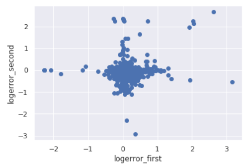

# Zillow: Overview

In this [competition](https://www.kaggle.com/c/zillow-prize-1), Zillow is asking you to predict the log-error between their Zestimate and the actual sale price, given all the features of a home. The log error is defined as:

                                          logerror=log(Zestimate)−log(SalePrice)
                                          
and it is recorded in the transactions file train.csv. In this competition, you are going to predict the logerror for the months in Fall 2017. Since all the real estate transactions in the U.S. are publicly available, we will close the competition (no longer accepting submissions) before the evaluation period begins.

# Train/Test Split

* You are provided with a full list of real estate properties in three counties (Los Angeles, Orange and Ventura, California) data in 2016.
* The train data has all the transactions before October 15, 2016, plus some of the transactions after October 15, 2016.
* The test data in the public leaderboard has the rest of the transactions between October 15 and December 31, 2016.
* The rest of the test data, which is used for calculating the private leaderboard, is all the properties in October 15, 2017, to December 15, 2017. This period is called the "sales tracking period", during which we will not be taking any submissions.
* You are asked to predict 6 time points for all properties: October 2016 (201610), November 2016 (201611), December 2016 (201612), October 2017 (201710), November 2017 (201711), and December 2017 (201712).
* Not all the properties are sold in each time period. If a property was not sold in a certain time period, that particular row will be ignored when calculating your score.
* If a property is sold multiple times within 31 days, we take the first reasonable value as the ground truth. By "reasonable", we mean if the data seems wrong, we will take the transaction that has a value that makes more sense.

# File Descriptions

* properties_2016.csv - all the properties with their home features for 2016. Note: Some 2017 new properties don't have any data yet except for their parcelid's. Those data points should be populated when properties_2017.csv is available.
* properties_2017.csv - all the properties with their home features for 2017 (released on 10/2/2017)
* train_2016.csv - the training set with transactions from 1/1/2016 to 12/31/2016
* train_2017.csv - the training set with transactions from 1/1/2017 to 9/15/2017 (released on 10/2/2017)
* sample_submission.csv - a sample submission file in the correct format

# Data Fields

* Please refer to zillow_data_dictionary.xlsx

# Experience Overview

Before I start writing my experience is that when I started this data challenge, I already have the access to both 2016 and 2017 data, which is different from how the competition went. So I started modelling with both datasets from the beginning.

We are provided with training data from 2016 January to 2017 September. We are also provided with properties datasets in 2016 and 2017 which contain basic information (size, room count et.al.) about different lots. And we are asked to predict logerror in October, November and December of 2016 and 2017. Remember, we are asked to predict logerror, which is the log(Zestimate) from company's model minus log(SalePrice). This means we are doing residual modelling.

# Data preprocessing

By doing some EDA, a very noticable phenomenon in datasets properties_2016 and properties_2017 is that a lot of numerical features have a highly skewed data distribution. Therefore I take log of these features to make distributions close to normal. This also makes sense because the logerror we are trying to predict is the percentage difference between estimation and deal price. To match this, for features such as housing price or size, taking the log can be helpful since it helps to understand the percentage difference.

By examining target value logerror distribution we can see most logerror values are in the range of (-0.2, 0.2) with some large outliers. We keep the logerror value during data preprocessing stage. Then we merge the train_2016 with properties_2016 and train_2017 with properties_2017 and combine these two merged datasets together to form the training set.

# Feature Engineering

The most important feature comes from samples with more than 1 sale records in the training set. In the figure below logerror_first is from the previous record and logerror_second is the target logerror. And we can see the model tends to underestimate the price for lots with sale records, which results in a overall negative logerror. Based on this observation, lag features such as last logerror and last sale month are generated. However, this feature will not help public leaderboard since they aren't many lots sold twice within one year. Over 90 percent of this part of data comes from 2017 training dataset.

Besides the sale record features, target encoding using combination of categorical features (county + propertycountylandusecode, city + propertycountylandusecode, county + zoningdesc, city + zoningdesc et. al.) also helps a little.

# Modelling

Since we are asked to predict the error, we should be careful with the outlier. The intuition is there is no way a logerror whose magnitude is larger than 1 can be predicted since first there is not much data; second this can come from "accidents" and we don't have enough information to understand these accidents. I tried both throwing away outliers and clipping target logerror values. In my case clipping target logerror values is a little better.

Lightgbm model is used with 5 fold cross-validation after shuffling the data. Later on 7 and 8 folds are tried and they only slightly improve the result. Xgboost is signficantly worse than lightgbm. I also tried fully connected neural network but it also doesn't help so I stick to lighgbm model. Another big improvent comes from the change of loss function in lightgbm. After changing loss function from mean-squared-error (mse) to mean-abosulte-error (mae), the result improves a lot. This may be because mae is more robust and less influenced by outliers. Later, it is also observed by clipping target values comparably good results can be achieved with mse loss function.

My individual lightgbm models trained with different random seeds achieve around 0.06418 in public leaderboard (LB) and 0.07447 in private LB. Blending 6 models with best public LB results give a 0.06414 public LB and 0.07443 private LB, which ranks 200th in the public LB and 6th in the private LB out of 3775 participating teams.

# Summary

Baseline model: public: 0.06499  private: 0.07581
What works:
* Winsorization (Clip target value) (public: 0.06466  private: 0.07548)
* Change loss function (public: 0.06417  private: 0.07503)
* Lag features (public: 0.06420  private: 0.07453)
* Target encoding (public: 0.06417  private: 0.07446)
* Blending (public: 0.06414  private: 0.07443)

What doesn't work:

* xgboost
* Fully connected neural network
* Aggregation features
* Stacking
* Time related features
* Build a classification model to classify outliers

# Things to improve

* Un-supervised learning methods and clustering algorithm
* Feature engineering
